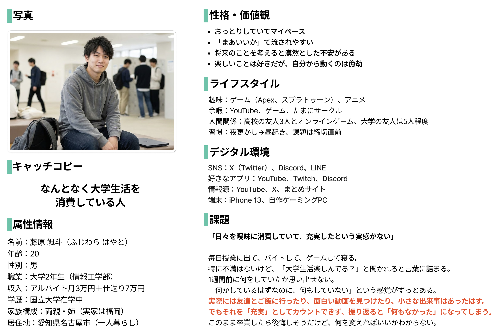

# P2HACKS2025 アピールシート

---

クイックスタート等、技術面に関するドキュメントは [PROJECT.md](./PROJECT.md) を参照してください。

---
## プロダクト名
リフレクト新世界(りふれくとしんせかい)

## コンセプト
日常のキラキラした思い出を、新世界として可視化することで振り返りやすく、生活に意味を与えるアプリ。

## 対象ユーザ
「先週何やってたっけ…」
友達とご飯に行ったり、外で面白い看板を見つけたり、日常に溢れているはずのキラキラした思い出。でもいつかはその記憶も薄れ、「何もしてないよ…」という虚無感に襲われます。
そんな虚無感を抱えていくのは嫌だ、日記を書いてみたいけど準備も面倒だし続けていける自信もない、そんな「なんとなく日常生活を消費している人」が対象です。

### 具体的なペルソナ

## 利用の流れ
アプリを起動すると、そこにはまっさらな世界と、新しい世界に生きる人々の日常が広がっています。

ユーザーは何か残しておきたい出来事があったときに記録を書きます。これは日記のように長々書く必要はありません。いつでもどこでも、書きたいと思った時に書きましょう。
ユーザーが記録を出すと新世界の住人の発言が記録に影響を受け、SNSのように流れていきます。
そして次の日、その影響が新世界そのものに広がり、新世界の一部として実際に可視化されます。
一週間の区切りで世界の変化は保存され、いつでも振り返ることができるようになります。
ビジュアルや短い記録として保存された日常は、振り返りやすく、見ていてワクワクするものになっています。いつでも日常のキラキラした思い出を振り返り、充実感を得られます。

## 推しポイント
- 日記よりも気軽にできる記録：

誰もが一度は「日記書いてみようかな」と思ったことがあるでしょう。しかし、『日記帳の用意はめんどくさい』・『スマホで書くにしても長々かけない』・『1日の終わりに1行も続く気がしない(夏休みの一行日記も最終日に書いていたから)』などの理由でチャレンジをしている人も少ないと思います。
このアプリではその悩みを解消します。何か記録したいことがあった時に、一言でもしっかりでも、1日に何回でも記録することができます。SNSのような使い方をしているうちに、日々を振り返るための「記録」が溜まっていきます。

- 新世界のビジュアル化で振り返りやすい

従来の日記は文字ばかりです。写真を貼ったとしてもメインは文字の塊、書いたとしても振り返るのは少し億劫です。
このアプリでは1日ごとの記録が小さく、特徴を捉えた新世界として、ビジュアルとして保存されていきます。このビジュアルは一覧した時のワクワク感、ぱっと見の振り返りやすさを両立し、文字を読まなくてもその時のキラキラした思い出を振り返ることができるようになっています。

- 世界の住人による発言で、受動的に思い出を振り返ることができる

そもそも日記というものは、自分で振り返ろうと思わないと見返すことができないものです。
このアプリでは新世界の住人がユーザーの記録によって影響をうけ、発言する内容が少しずつ変化していきます。SNS風UIでその発言を眺めているだけで「そういえばこんなこともあったな」と、キラキラを思い出すきっかけになるのです。

- このアプリは、従来の日記の問題点である、「各自のモチベーションへの依存」

を可能な限り減らしています。
いつでも気軽に残せる記録、新世界というビジュアルでの振り返り、SNS風UIでの発言による受動的な振り返りを組み合わせることで、日常の虚無感への対抗策であった「日記」よりももっと簡単に、より効果的にしました。
このアプリを利用することで、自分の日常をより良いものとして受け取り、生活を振り返った時の虚無感を無くし、充実した生活を実感することができます。

## スクリーンショット(任意)
SNS風UI：新世界に住む住人の声が流れる。ユーザーの記録に影響を受けたものが流れることもある。

記録入力画面：記録を入力する。日記より気軽に書くために文字数は140字以内、写真は1枚まで。

振り返り画面(カレンダー)：これまでに作り出された世界を週ごとに確認できる。タップで詳細へ。

振り返り画面(詳細)：作り出された新世界について、それを構成している記録・住人の声が確認できる。

新世界更新ポップアップ：記録を書いた次の日や週の世界が完成した時に表示される。

プロフィール画面：ユーザーのプロフィール画面。その週の世界を他のSNSに共有することもできる。

共有カード：SNSに共有する際のカード。

## 開発体制

### 役割分担

uiro(山﨑拓己)
・プロジェクトマネージャー
・レビュー
・フロントエンド（ReactNative）

こはぜ(川島与壱)
・テックリード（技術選定、レビュー、Codeowner）
・フロントエンド（ReactNative）
・バックエンド（DB設計、Hono）

wisteria(藤井優気)
・バックエンド（DB設計、Hono、cronワーカー）

もち(遠藤七佳)
・フロントエンド（ReactNative）
・デザイン
・スライド

いも(小野耕太)
・デザイン
・スライド
・登壇

### 開発における工夫した点

#### アイデア出し
プロダクトのアイデア出しにおいて「発散」・「収束」のサイクルを繰り返すことを重視しました。
全てのフェーズにおいて、明確なゴールと制限時間を設定することで、メンバー全体で認識を揃えながら議論し、「アイデアが止まる時間」を発生させないようにしました。
テーマ発表後のプロダクト決定までの流れ
- 「キラキラ」というテーマに沿ってブレインストーミングを行いました。個数を出すことを重視し、チームで100以上のアイデアを出しました。(発散)
- ブレインストーミングで出たアイデアのグルーピングを行いました。(収束)
- それぞれのグループから2つ以上のアイデアを選び、アイデアを合成してアイデアを発散させました。各自3種類以上のアイデアを出すことを決め、思いついたものはとりあえずアイデアとしました。(発散)
- 発生したアイデアから、「具体的な課題が存在しそうなもの」「アイデアに当てはまるターゲットがいそうなもの」を話し合いながら決定・結合し、アイデアを絞り込み、そこから課題への共感度が特に高いものにアイデアの方向性を決定しました。(収束)
- アイデアについて考えうる課題を考えたり、関係するキーワード[日記]について調べるなどしてアイデアに潜在的に含まれる課題を洗い出しました。(発散)
- 特に共感性の高い課題に絞り込み、そこからペルソナを作成。具体的なペルソナを作成することで、表面的な課題の芯にある主となる課題[日常生活について、何もないという虚無感がある]を見つけました(収束)
- 見つかった課題に対して、アイデアを元にしたプロダクトを複数考えました。(発散)
- それぞれのプロダクト案について実現可能性・課題解決力・発表映え・技術としての面白さの観点から検討し、プロダクト案を合成し一つのプロダクトに決定しました。(収束)

#### レビュー体制

1 Issue = 1 PR とセルフマージ禁止を軸に、AIレビュー/CI も組み合わせて、 main ブランチを壊さない運用を徹底しました。
- 1 Issue = 1 PR として、それぞれのPRで何を達成しているべきなのかを明確にしました
- テックリード含めセルフマージを禁止し、第三者レビューを必須化しました
- レビューによる指摘には優先度バッジを付け、レビューが開発のボトルネック化するのを防止しました
- 「人による動作確認に加え、AIによるコードチェックとCI（型チェック・整形・ビルド確認）を組み合わせることで、mainブランチが常に正常に動作する状態を維持しました

#### プロジェクト管理

- NotionとGitHub Projectsを活用し、開発だけでなく準備からデザイン、発表まで全てのタスクを管理しました。
- 毎日行う定例会によって、全員の進捗と困っていること、次のタスクを全員で共有しました。PMだけでなくチーム全員が状況を把握できる体制を整えることで、役割の明確化と、質問をする相手が明確になることによる、コミュニケーションコストの削減を実現しました。
- GitHub Projects では、ラベルやプロパティなどの機能を最大限活かし、PMが維持可能な範囲でタスクの視覚化を行いました。最低限のアプリ（MVP）のために必要な機能と、追加機能としてアプリの体験向上に寄与する機能、アプリとしての安定性を高めるが体験が改善するわけではない機能の3種類に分類し、今何をするべきかを常に意識した開発体制を作りました。
- タスクを規模・曖昧さで3段階に分類し、具体的なタスクにまで分解してから各自にアサインするようにしました

#### Claude Code 活用（開発効率と実装ブレの抑制）

Claude Code をチーム開発に組み込みやすい形に整備し、並列開発でも手戻りが起きにくい運用を行いました。
- Issue を細かく分割して並列で作業できるようにし、コンフリクトが起きにくい粒度・進め方で運用しました
- 各 appsとpackages に CLAUDE.md / RECIPES.md / README.md の3段階ドキュメントを整備し、AI 実装の前提・手順・仕様がブレないようにしました
- AI によるレビューを取り入れ、レビュー依頼後の修正対応の初速を上げました
各ドキュメントの詳細は[ドキュメントマップ](./PROJECT.md#ドキュメントマップ)をご確認ください。

#### 新世界生成AI機能の設計

複数のAIモデルを組み合わせた**マルチLLMワークフロー**を設計しました。

**ワークフロー設計**:
[日記投稿] → GPT-4.1（テキスト理解） → [シーン記述] → Gemini（画像生成） → [世界画像]

各AIの得意分野を活かし、処理を分担しています:

| 処理 | モデル | 選定理由 |
|------|--------|----------|
| シーン記述生成 | OpenAI GPT-4.1 | プロンプト遵守率が高く、制約付き出力が安定 |
| 画像生成 | Google Gemini | 画像編集のマルチモーダル処理に強い |
| AI投稿生成 | OpenAI GPT-4.1-nano | 軽量かつ高速なテキスト生成 |

**なぜ2段階か**: Geminiは画像生成能力は高いものの、複雑な制約を含むプロンプトへの遵守率が低く、単体では意図した画像を安定生成できませんでした。そこでGPTで制約に沿ったシーン記述を先に生成し、Geminiには単純化された指示のみを渡すことで、出力品質を大幅に改善しています 。

**プロンプト管理の工夫**:
- プロンプトをMarkdownファイルとして外部管理し、モデル設定は `llm-config.ts` で一元化
- 画像生成の安定化のため、シーン記述に制約ルール（FORBIDDEN項目）を設計
- ユーザー入力を含むプロンプトにはインジェクション対策を実装

詳細: [画像生成ワークフロー](./docs/image-generation-workflow.md)

## 開発技術

### 利用したプログラミング言語

- TypeScript

### 利用したフレームワーク・ライブラリ

**Webフロントエンド**
- Next.js/React
- Tailwind CSS
- react-hook-form
- HeroUI

**モバイルアプリ**
- React Native
- Expo
- HeroUI Native
- Uniwind
- React Native Reanimated
- react-hook-form
- OneSignal

**バックエンド**
- Hono
- @hono/zod-openapi
- Zod
- Supabase

**バッチ処理**
- Node.js
- node-cron
- Google Gemini API
- OpenAI
- Sharp

**データベース**
- Supabase（PostgreSQL）
- Drizzle ORM

**その他**
- Turborepo
- pnpm
- Biome
- Lefthook

### その他開発に使用したツール・サービス

- GitHub
- GitHub Projects
- Cloudflare Workers
- Cloudflare Hyperdrive
- Supabase
- Notion
- Figma
- ChatGPT
- Claude / Claude Code
- Gemini

