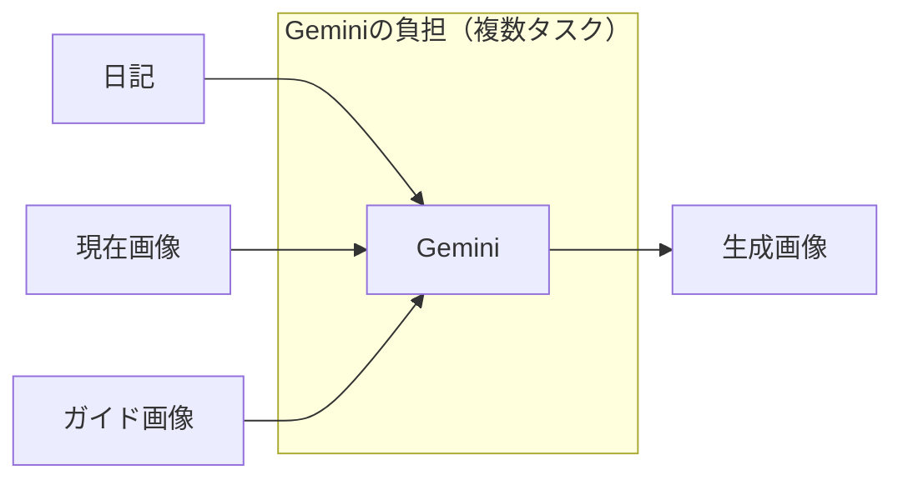
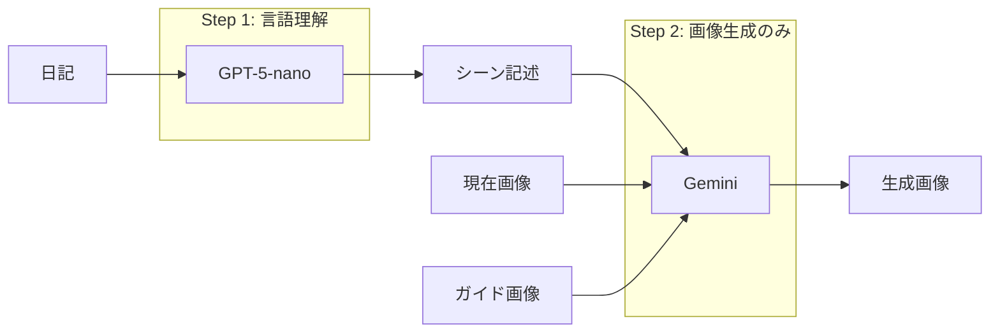
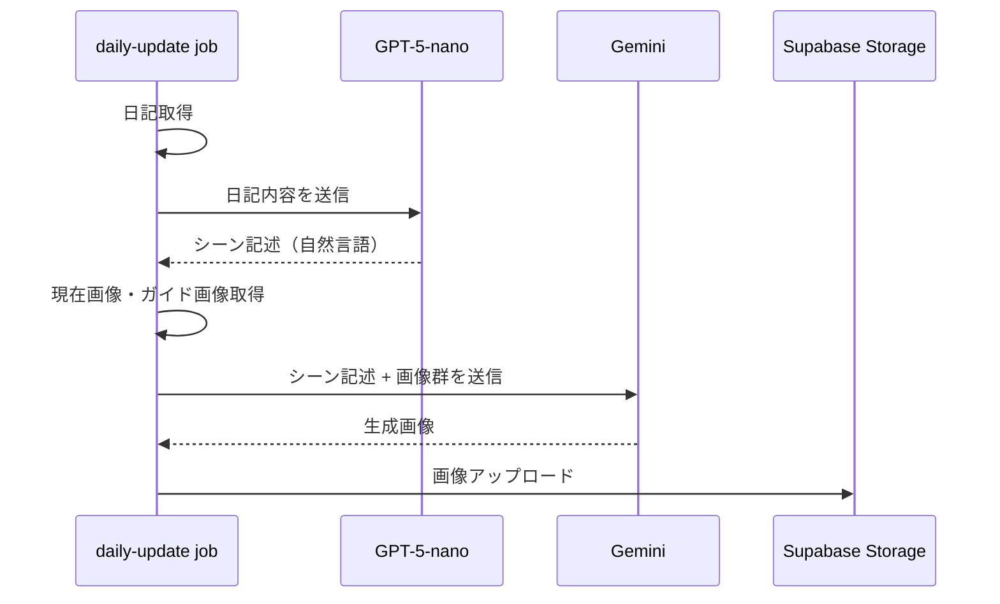
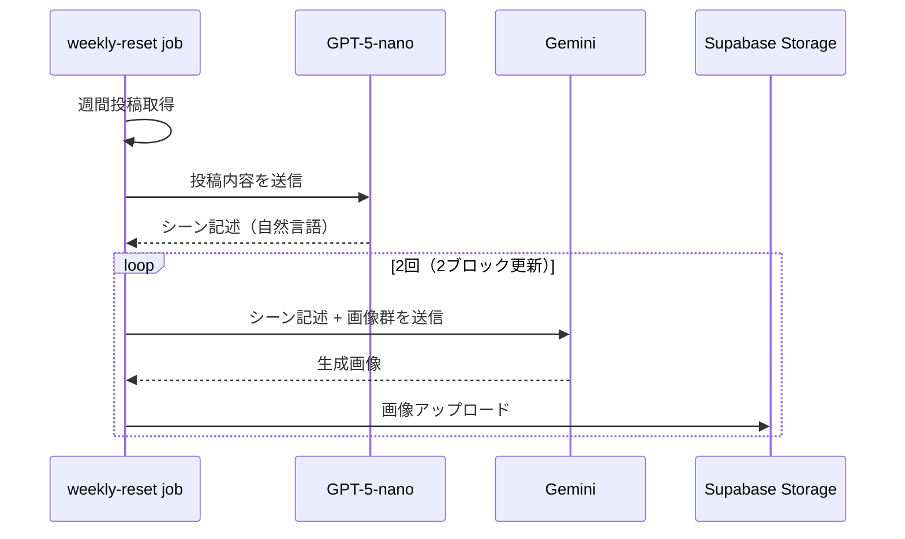

# 画像生成ワークフロー

## 概要

画像生成処理は2ステップに分離されており、各LLMの役割が明確化されています。

## アーキテクチャ

### 従来の問題点



**問題**: Geminiが以下を同時処理しており、精度が不安定
1. 日記内容の理解・解釈
2. シーンの決定（何を描くか）
3. ブロック更新位置の判断
4. 画像生成

### 新アーキテクチャ



**改善点**:
- **GPT-5-nano**: 日記→シーン記述（自然言語）に特化
- **Gemini**: 画像生成のシングルタスクに集中 → 精度向上

## 処理フロー

### daily-update



### weekly-reset



## LLM設定

設定は `lib/llm-config.ts` で一元管理されています。

```typescript
export const LLM_CONFIG = {
  sceneDescription: {
    model: "gpt-5-nano",
    maxCompletionTokens: 300,
  },
  imageGeneration: {
    model: "gemini-3-pro-image-preview",
    temperature: 0.1,
    seed: 1234,
    candidateCount: 1,
  },
} as const;
```

## プロンプト

### シーン記述生成（GPT-5-nano）

ファイル: `assets/prompts/scene_description.md`

日記内容から視覚的なシーン記述を生成します。

**出力例**:
- 入力: 「今日は友達とカフェに行った。美味しいケーキを食べながらたくさん話した。」
- 出力: 「明るいカフェで二人の友人がケーキを前に楽しそうに会話している」

### 画像生成（Gemini）

ファイル: `assets/prompts/image_generation_prompt.md`

シーン記述と参照画像から新しい画像を生成します。

## 関連ファイル

| ファイル | 役割 |
|---------|------|
| `lib/llm-config.ts` | LLM設定の一元管理 |
| `assets/prompts/scene_description.md` | シーン記述生成プロンプト |
| `assets/prompts/image_generation_prompt.md` | 画像生成プロンプト |
| `tasks/daily-update.ts` | 日次更新処理 |
| `tasks/weekly-reset.ts` | 週次リセット処理 |
