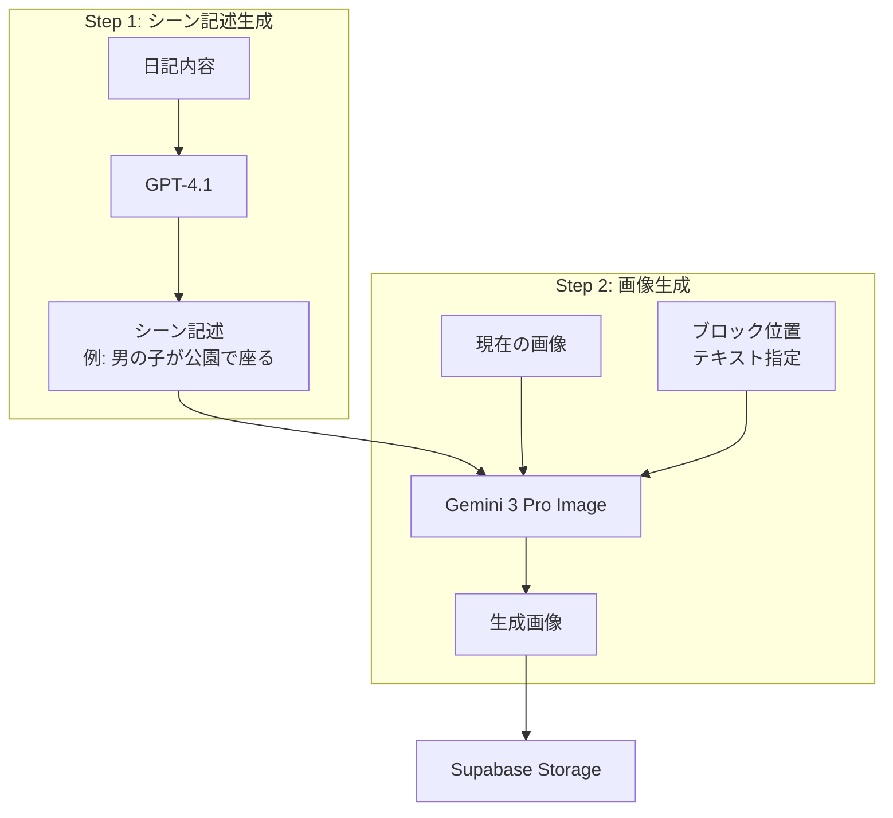
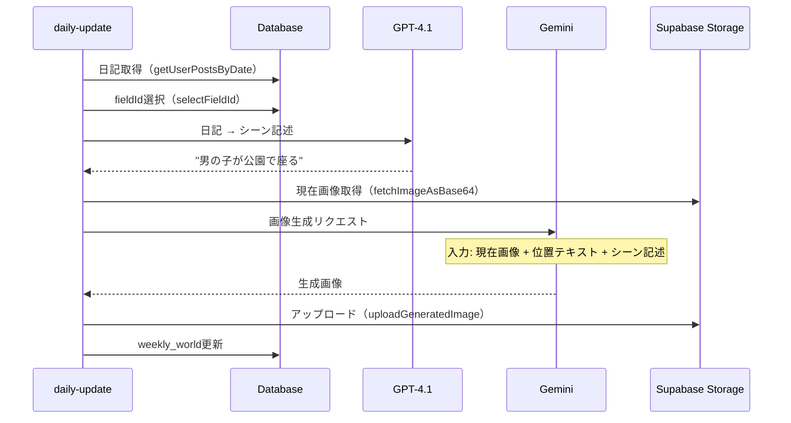
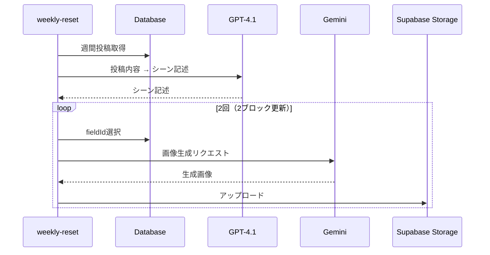

# 画像生成ワークフロー

## 概要

画像生成処理は2ステップに分離されており、各LLMの役割が明確化されています。

## アーキテクチャ



**ポイント**:
- **GPT-4.1**: 日記→シーン記述（自然言語）に特化、指示遵守が厳格
- **Gemini**: 画像生成のシングルタスクに集中
- **テキストベースの位置指定**: ガイド画像ではなくテキストでブロック位置を指定

---

## LLM設定

設定は `lib/llm-config.ts` で一元管理されています。

| 用途 | モデル | 備考 |
|------|--------|------|
| シーン記述生成 | gpt-4.1 | 指示遵守が厳格 |
| 画像生成 | gemini-3-pro-image-preview | 1K画像 |

```typescript
export const LLM_CONFIG = {
  sceneDescription: {
    model: "gpt-4.1",
  },
  imageGeneration: {
    model: "gemini-3-pro-image-preview",
    temperature: 0.1,
    seed: 1234,
    candidateCount: 1,
  },
} as const;
```

---

## シーン記述ルール

### 必須要素（REQUIRED）

| 要素 | 説明 | 例 |
|------|------|-----|
| **WHO** | キャラクター/人物 | 男の子, 女の子, 友人, うさぎ |
| **ACTION** | 静的な動詞 | 座る, 話す, 読む, 食べる |
| PLACE | 単一の場所（省略可） | カフェ, 公園, ベンチ |

### 禁止要素（FORBIDDEN）

| 要素 | 理由 | NG例 |
|------|------|------|
| 室内 | 壁/天井を生成してしまう | 部屋, リビング, 寝室, 家 |
| 時間情報 | 壁/背景を生成してしまう | 夜, 朝, 夕方, 静かな夜 |
| 景色/風景 | ブロック外に描画される | 絶景, 景色, 星空, 海 |
| 移動動詞 | 1ブロックに収まらない | 歩く, 向かう, 走る |
| 複合場所 | 複数の場所を示す | 駅前のカフェ |

### 出力例

| 入力（日記） | 出力（シーン記述） |
|-------------|-------------------|
| "今日は公園でゆっくり過ごした" | "男の子が公園で座る" |
| "友達とカフェで話した" | "友人とカフェで話す" |
| "夜、リビングでくつろいだ" | "女の子がソファで休む" |

---

## ブロック配置（ダイヤモンド型9ブロック）

```
        [0]              ← 1段目（トップ）
      [3] [1]            ← 2段目
    [6] [4] [2]          ← 3段目（中央）
      [7] [5]            ← 4段目
        [8]              ← 5段目（ボトム）
```

各ブロックはテキストで位置を指定:
- `0`: "1st tier from top (the single block at the very top)"
- `4`: "3rd tier (middle row), center block"
- `8`: "5th tier (the single block at the very bottom)"

---

## 処理フロー

### daily-update



### weekly-reset



---

## 関連ファイル

| ファイル | 役割 |
|---------|------|
| `lib/llm-config.ts` | LLM設定の一元管理 |
| `lib/constants.ts` | FIELD_POSITIONS（ブロック位置テキスト） |
| `assets/prompts/scene_description.md` | シーン記述生成プロンプト |
| `assets/prompts/image_generation_prompt.md` | 画像生成プロンプト |
| `tasks/daily-update.ts` | 日次更新処理 |
| `tasks/weekly-reset.ts` | 週次リセット処理 |
