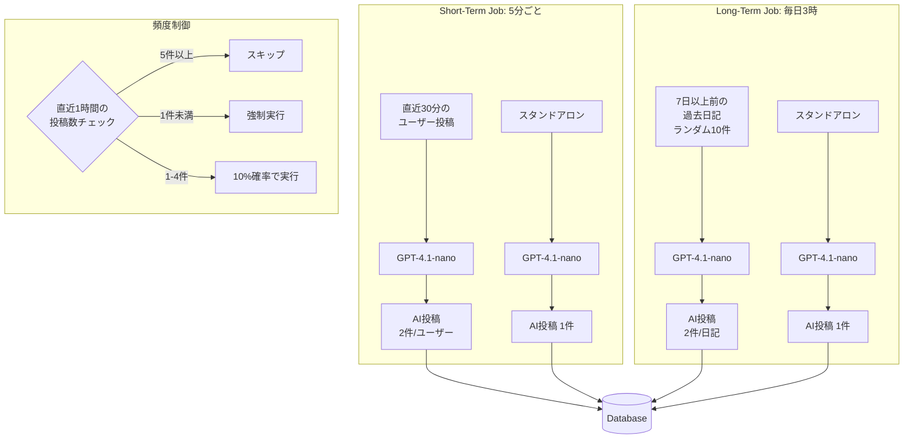
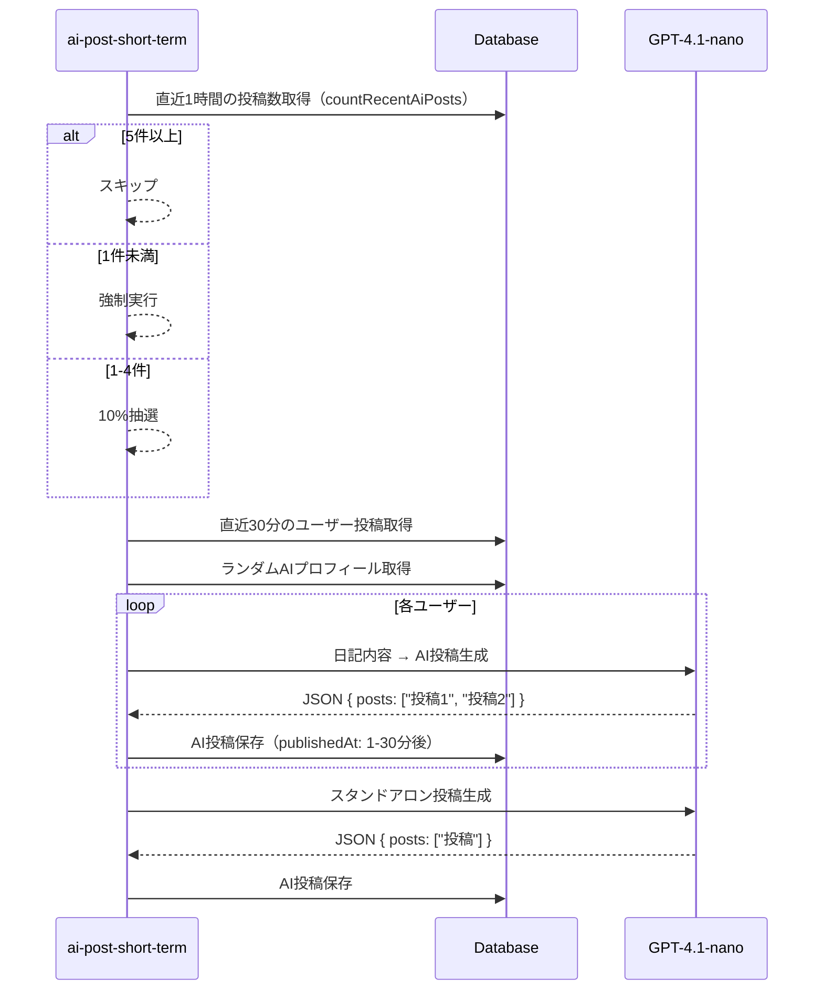
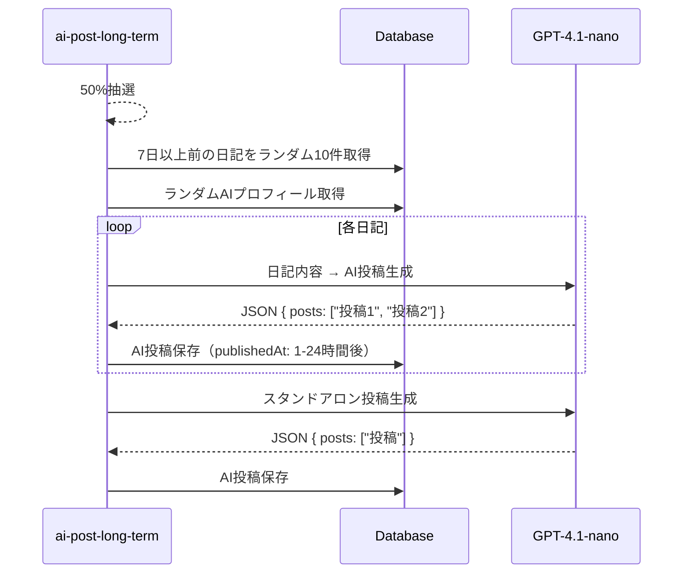

# AI投稿生成ワークフロー

## 概要

AIキャラクターがタイムラインに投稿を行う機能。ユーザーの日記に反応する投稿と、独立したスタンドアロン投稿の2種類を生成します。

---

## アーキテクチャ



**ポイント**:
- **GPT-4.1-nano**: 軽量・高速、短文生成に最適化
- **頻度制御**: 上限5件/h、下限1件/hでTLの投稿頻度を管理
- **2種類のジョブ**: リアルタイム反応（short-term）と過去日記の掘り起こし（long-term）

---

## LLM設定

設定は `lib/llm-config.ts` で一元管理されています。

| 用途 | モデル | 最大トークン | 備考 |
|------|--------|-------------|------|
| AI投稿生成 | gpt-4.1-nano | 500 | JSON形式で出力 |

```typescript
export const LLM_CONFIG = {
  aiPost: {
    model: "gpt-4.1-nano",
    maxCompletionTokens: 500,
    responseFormat: { type: "json_object" } as const,
  },
} as const;
```

---

## 生成設定

`tasks/ai-post.ts` の `AI_POST_CONFIG` で管理されています。

| 設定 | 値 | 説明 |
|------|-----|------|
| POSTS_PER_USER | 2 | ユーザー日記あたりの生成数 |
| STANDALONE_POST_COUNT | 1 | スタンドアロン投稿数 |
| MAX_POST_LENGTH | 50 | 最大文字数 |
| SHORT_TERM_POST_CHANCE | 0.1 | short-term実行確率（10%） |
| LONG_TERM_POST_CHANCE | 0.5 | long-term実行確率（50%） |

---

## プロンプトルール

### 基本方針

| 項目 | ルール |
|------|--------|
| 文字数 | 50文字以内 |
| 絵文字 | なし or たまに（自然な場合のみ） |
| 文体 | カジュアル、人間らしく |
| トーン | 会話的、自然体 |

### 良い例

```
- "今日はなんかいい日だな"
- "コーヒー飲みすぎた"
- "散歩してきた、気持ちよかった"
- "明日も頑張るか"
- "雨やんでほしい"
```

### 悪い例

```
- "今日は素晴らしい一日でした！✨🎉" （絵文字過多、フォーマルすぎ）
- "本日の活動報告です。" （堅すぎる）
```

---

## 頻度制御

`jobs/ai-post-short-term.ts` で実装されています。

### パラメータ

| 設定 | 値 | 説明 |
|------|-----|------|
| FREQUENCY_CHECK_WINDOW_MINUTES | 60 | チェック対象の時間窓 |
| MAX_POSTS_PER_HOUR | 5 | 上限（超過でスキップ） |
| MIN_POSTS_PER_HOUR | 1 | 下限（未満で強制実行） |

### ロジック

```mermaid
flowchart TD
    start[ジョブ開始] --> count[直近1時間の投稿数取得]
    count --> checkMax{5件以上?}
    checkMax -->|Yes| skip1[スキップ]
    checkMax -->|No| checkMin{1件未満?}
    checkMin -->|Yes| force[強制実行]
    checkMin -->|No| lottery{10%抽選}
    lottery -->|当選| execute[実行]
    lottery -->|外れ| skip2[スキップ]
    force --> execute
    execute --> generate[投稿生成]
```



### 動的調整

残り枠が3件未満の場合、投稿数を動的に調整:

```typescript
if (remaining < 3) {
  effectivePostCount = Math.floor(Math.random() * (remaining + 1));
}
```

---

## ジョブ詳細

### ai-post-short-term

| 項目 | 値 |
|------|-----|
| スケジュール | `*/5 * * * *`（5分ごと） |
| 実行確率 | 10%（下限未満時は強制） |
| 対象 | 直近30分のユーザー投稿 |
| 公開時刻 | 1〜30分後にランダム分散 |
| 生成数（実行時） | ユーザー日記×2 + スタンドアロン1 |

### ai-post-long-term

| 項目 | 値 |
|------|-----|
| スケジュール | `0 3 * * *`（毎日午前3時） |
| 実行確率 | 50% |
| 対象 | 7日以上前の過去日記からランダム10件 |
| 公開時刻 | 1〜24時間後にランダム分散 |
| 生成数（実行時） | 日記10件×2 + スタンドアロン1 = 最大21件 |

---

## 処理フロー

### ai-post-short-term



### ai-post-long-term



---

## 関連ファイル

| ファイル | 役割 |
|---------|------|
| `lib/llm-config.ts` | LLM設定の一元管理 |
| `lib/prompt.ts` | テンプレート変数置換ユーティリティ |
| `lib/infra/ai-post.ts` | AI投稿のDB操作（作成、カウント） |
| `assets/prompts/ai_post_generation.md` | ユーザー日記ベースの生成プロンプト |
| `assets/prompts/ai_post_standalone.md` | スタンドアロン生成プロンプト |
| `tasks/ai-post.ts` | AI投稿生成のコアロジック |
| `jobs/ai-post-short-term.ts` | short-termジョブ（頻度制御含む） |
| `jobs/ai-post-long-term.ts` | long-termジョブ |
