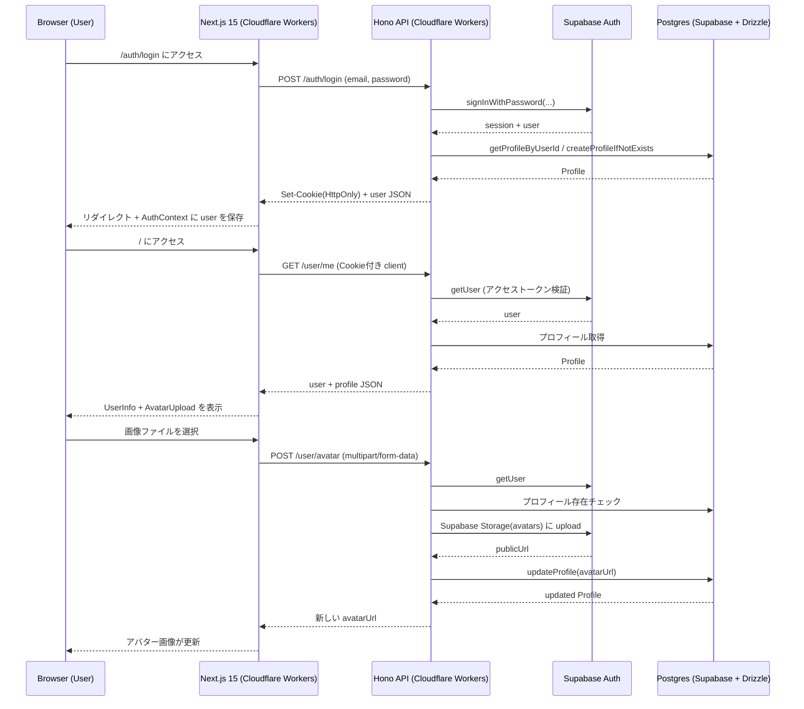

# 技術選定・アーキテクチャ

## 概要

- このドキュメントは「このプロジェクトの技術的な全体像」をまとめたものです。
- プロダクトの要件・スコープ・UXに関する記述は含みません。

## 目次

- [大まかな全体像](#大まかな全体像)
  - [ブラウザ](#ブラウザ)
  - [バッチ処理（Worker）](#バッチ処理worker)
  - [共通パッケージ](#共通パッケージ)
- [技術スタックと採用理由](#技術スタックと採用理由)
  - [モノレポ管理: Turborepo + pnpm](#モノレポ管理-turborepo--pnpm)
  - [バックエンド: Hono + Node.js + TypeScript](#バックエンド-hono--nodejs--typescript)
  - [フロントエンド: Next.js + React + TypeScript](#フロントエンド-nextjs--react--typescript)
  - [スタイル(web): Tailwind CSS (+ HeroUI)](#スタイルweb-tailwind-css--heroui)
  - [ネイティブ: React Native + Expo + TypeScript](#ネイティブ-react-native--expo--typescript)
  - [スタイル(native): Uniwind + HeroUI Native](#スタイルnative-uniwind--heroui-native)
  - [環境変数管理: Zod + direnv (+ packages/env)](#環境変数管理-zod--direnv--packagesenv)
  - [ログ管理: 共通ロガー (packages/logger)](#ログ管理-共通ロガー-packageslogger)
  - [DB / 認証: Supabase + Postgres + Drizzle ORM](#db--認証-supabase--postgres--drizzle-orm)
  - [API クライアント/サーバーコード生成: HonoRPC + packages/api-contract](#api-クライアントサーバーコード生成-honorpc--packagesapi-contract)
  - [デプロイ: Cloudflare Workers + GitHub Actions](#デプロイ-cloudflare-workers--github-actions)
- [Web → API → DB / Supabase のリクエストフロー(一例)](#web--api--db--supabase-のリクエストフロー一例)

## 大まかな全体像

### ブラウザ
1. `apps/web` (Next.js)
1. `packages/api-contract` 経由で API 呼び出し
1. `apps/api` (Hono + HonoRPC)
1. `packages/db` (Drizzle ORM) 経由で Supabase (Postgres) にアクセス
1. JSON レスポンスを返却
1. web で画面を描画

### バッチ処理（Worker）
1. `apps/worker` (Node.js + tsx)
1. CLI モード（単発実行）またはデーモンモード（node-cron スケジュール）
1. `packages/db` (Drizzle ORM) 経由で Supabase (Postgres) にアクセス
1. 定期的なデータ同期、ヘルスチェックなどを実行

### 共通パッケージ

- `packages/api-contract`: API の型定義と HonoRPC のクライアント/サーバーコード生成
- `packages/db`: Drizzle ORM のスキーマ定義と DB アクセスコード
- `packages/env`: 環境変数の型定義とバリデーションロジック
- `packages/logger`: 共通ロガー実装
- `packages/schema`: APIの入力/出力スキーマ定義（Zodベース）

## 技術スタックと採用理由

### モノレポ管理: Turborepo + pnpm

- Turborepo
  - `apps/*` と `packages/*` をまとめて管理するためのツール
  - 依存関係とビルドパイプラインを自動でいい感じにやってくれるのでモノレポ運用が楽
- pnpm
  - インストールが早くディスク容量も食わない
  - pnpm-workspace.yaml でモノレポ内のパッケージを簡単に参照できる

### バックエンド: Hono + Node.js + TypeScript

- Hono
  - Cloudflare Workers 上で動かしやすい軽量なフレームワーク
  - ルーティングとミドルウェアの仕組みがシンプルで使いやすい
- TypeScript
  - monorepo全体で型安全性を確保し、開発効率を向上させるために採用

### フロントエンド: Next.js + React + TypeScript

- Next.js(App Router)
  - メンバーにNext.js経験者が多く、迅速な開発を可能にするために採用
- React + TypeScript
  - APIとの型安全な連携を実現し、開発効率を向上させるために採用

### スタイル(web): Tailwind CSS (+ HeroUI)

- Tailwind CSS
  - メンバーに経験者が多く、コンポーネントをサクッと組めるために採用
- HeroUI
  - React Aria ベースのアクセシブルな UI コンポーネントライブラリ
  - Native 版と共通の設計思想で、Web/Mobile 間の一貫性を確保

### ネイティブ: React Native + Expo + TypeScript

- React Native
  - Webと同じ技術スタックでクロスプラットフォーム開発を行い、開発効率を向上させるために採用
- Expo
  - ネイティブ開発の複雑さを軽減し、迅速な開発を可能にするために採用

### スタイル(native): Uniwind + HeroUI Native

- Uniwind
  - Tailwind CSSライクなユーティリティファーストのスタイリングを提供し、開発効率を向上させるために採用
- HeroUI Native
  - Uniwindと相性が良く、基本的なUIコンポーネントを提供するために採用

### 環境変数管理: Zod + direnv (+ packages/env)

- Zod
  - 環境変数を起動時にチェックして、「設定ミスで動かない」を防止するために採用
  - APIのスキーマ定義にもZodを使うので、ツールを統一
- direnv
  - ローカル開発環境で.envファイルを自動読み込みするために採用
- packages/env
  - `env.XYZ` の形で型安全に環境変数にアクセスするための薄いラッパーを実装

---

以下はよりブラックボックス寄りの技術選定理由です。興味があればお読みください。
理解しなくても開発には支障ありません。

### ログ管理: 共通ロガー (packages/logger)

- Cloudflare Workers のログを扱いやすくするために、共通のloggerを用意
  - 本番: JSON形式で出力して、後で検索しやすくする
  - ローカル: 人間が読みやすいフォーマットで出力

### DB / 認証: Supabase + Postgres + Drizzle ORM

- Supabase
  - 認証・ストレージ・Postgres DB を一括で提供してくれる BaaS
  - ローカル開発環境でも同じような環境を構築でき、本番環境との差異によるトラブルを減らすために採用
- Drizzle ORM
  - DB周りの型安全性を確保し、開発効率を向上させるために採用
  - Supabase の Postgres と相性が良く、軽量で使いやすい

### API クライアント/サーバーコード生成: HonoRPC + packages/api-contract

- HonoRPC
  - APIの型定義からクライアント/サーバーコードを自動生成し、型安全なAPI通信を実現するために採用
- packages/api-contract
  - APIの型定義と HonoRPC のコード生成ロジックをまとめ、モノレポ内で再利用可能にするために採用

### linter / formatter: Biome
- Biome
  - 高速な lint と format を実現するために採用
  - monorepo 全体で一貫したコード品質を保つために全体で同じ設定を共有

### デプロイ: Cloudflare Workers + GitHub Actions
- Cloudflare Workers
  - 無料〜安価でデプロイ上限が高く、安定しているために採用
  - web と API を同じプラットフォームでホスティングでき、運用が楽
- GitHub Actions
  - Workers のビルド枠を消費せずにデプロイできるために採用
  - リポジトリ上で成功/失敗の履歴が確認でき、運用が楽

---

## Web → API → DB / Supabase のリクエストフロー(一例)

