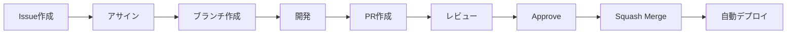

# 開発フロー

このドキュメントでは、チケット方式の開発フローについて説明します。

## フロー概要



## 1. Issue

### Issueテンプレート

| テンプレート | 用途 |
|-------------|------|
| Epic | 大きな機能群やテーマ |
| Feature | 個別の機能 |
| Task | 具体的な作業項目 |
| Bug | バグ報告 |

アサインされたIssueから作業を開始します。

## 2. ブランチ作成

### 命名規則

```
prefix/#issue-number/説明
```

| prefix | 用途 |
|--------|------|
| `feature` | 新機能 |
| `fix` | バグ修正 |
| `docs` | ドキュメント |
| `chore` | その他 |

### 例

```bash
git checkout main
git pull origin main
git checkout -b feature/#123/add-login-form
```

## 3. 開発

### 開発サーバー起動

```bash
pnpm dev
```

### コミット

**メッセージ形式**: `prefix: 日本語説明`

| prefix | 用途 |
|--------|------|
| `feat` | 新機能 |
| `fix` | バグ修正 |
| `docs` | ドキュメント |
| `refactor` | リファクタリング |
| `chore` | その他 |

```bash
git commit -m "feat: ログインフォームを追加"
git commit -m "fix: バリデーションエラーを修正"
git commit -m "docs: READMEを更新"
```

> **Tips**: コミットは頻繁にしましょう。マージ時にSquashでまとめられるので、履歴が汚くなることを気にする必要はありません。作業のキリがいい時、移動する前など、とりあえずコミットしておくのがおすすめです。

### pre-commitフック

コミット時にBiomeによる自動フォーマットが実行されます。

## 4. PR作成

### Draft PRの活用

作業開始時点でDraft PRを作成し、進捗を共有することを推奨します。

### CIチェック

PRを作成すると以下が自動実行されます:
- Biomeによるコードチェック
- TypeScript型チェック
- プレビュー環境へのデプロイ

## 5. レビュー

### レビュー依頼

Draft PRを「Ready for review」に変更し、コードオーナーにレビューを依頼します。

### 修正対応

レビューコメントに対応し、追加コミットをプッシュします。

## 6. マージ

### コンフリクト発生時の対応

Approve後にmainブランチとのコンフリクトが発生した場合でも、コンフリクトを解消すればマージできます。

1. mainブランチをマージまたはリベースしてコンフリクトを解消
2. CIが通ることを確認
3. マージを実行

> **Note**: コンフリクト解消の変更が大きい場合（ロジックの変更を伴う等）は、各自の判断で再レビューを依頼してください。

### 手順

Approveを受けたら、PR作成者が自分でマージしてください。

1. **Squash and merge** を選択
2. マージコミットメッセージを確認
3. マージを実行

### 自動デプロイ

mainブランチへのマージ後、本番環境へ自動デプロイされます。
