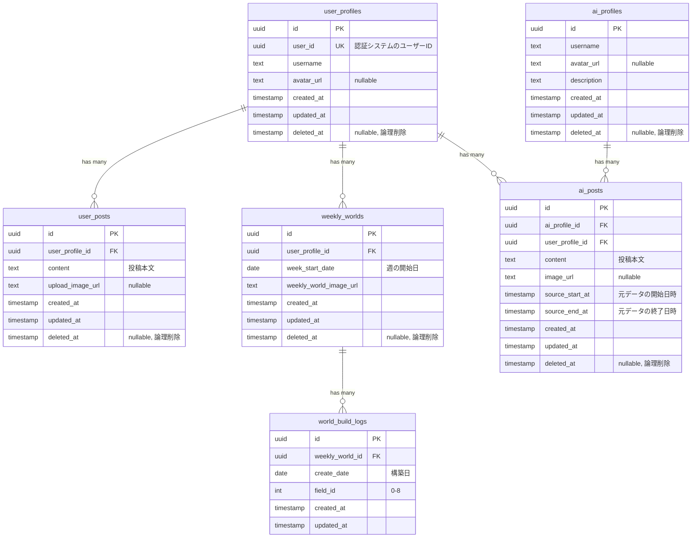

# ER図

## データベース設計



## テーブル詳細

### user_profiles

ユーザーのプロフィール情報を管理するテーブル。

| カラム名 | 型 | 制約 | 説明 |
|---------|-----|------|------|
| id | uuid | PK | 主キー |
| user_id | uuid | UK, NOT NULL | 認証システム（Supabase Auth）のユーザーID |
| username | text | NOT NULL | ユーザー名 |
| avatar_url | text | nullable | アバター画像URL |
| created_at | timestamp | NOT NULL | 作成日時 |
| updated_at | timestamp | NOT NULL | 更新日時 |
| deleted_at | timestamp | nullable | 論理削除日時 |

### user_posts

ユーザーの投稿を管理するテーブル。

| カラム名 | 型 | 制約 | 説明 |
|---------|-----|------|------|
| id | uuid | PK | 主キー |
| user_profile_id | uuid | FK, NOT NULL | user_profiles.id への外部キー |
| content | text | NOT NULL | 投稿本文 |
| upload_image_url | text | nullable | 投稿に添付された画像URL |
| created_at | timestamp | NOT NULL | 作成日時 |
| updated_at | timestamp | NOT NULL | 更新日時 |
| deleted_at | timestamp | nullable | 論理削除日時 |

### weekly_worlds

週ごとに生成されるユーザーの「世界」を管理するテーブル。

| カラム名 | 型 | 制約 | 説明 |
|---------|-----|------|------|
| id | uuid | PK | 主キー |
| user_profile_id | uuid | FK, NOT NULL | user_profiles.id への外部キー |
| week_start_date | date | NOT NULL | 対象週の開始日（月曜日） |
| weekly_world_image_url | text | NOT NULL | 生成された世界の画像URL |
| created_at | timestamp | NOT NULL | 作成日時 |
| updated_at | timestamp | NOT NULL | 更新日時 |
| deleted_at | timestamp | nullable | 論理削除日時 |

**制約**: `(user_profile_id, week_start_date)` でユニーク（同一ユーザー・同一週で1つのみ）

### ai_profiles

AIキャラクターのプロフィール情報を管理するテーブル。

| カラム名 | 型 | 制約 | 説明 |
|---------|-----|------|------|
| id | uuid | PK | 主キー |
| username | text | NOT NULL | AI名 |
| avatar_url | text | nullable | アバター画像URL |
| description | text | NOT NULL | AIの説明・性格設定など |
| created_at | timestamp | NOT NULL | 作成日時 |
| updated_at | timestamp | NOT NULL | 更新日時 |
| deleted_at | timestamp | nullable | 論理削除日時 |

### ai_posts

AIによる投稿を管理するテーブル。ユーザーの投稿を元に生成される。

| カラム名 | 型 | 制約 | 説明 |
|---------|-----|------|------|
| id | uuid | PK | 主キー |
| ai_profile_id | uuid | FK, NOT NULL | ai_profiles.id への外部キー |
| user_profile_id | uuid | FK, NOT NULL | user_profiles.id への外部キー（対象ユーザー） |
| content | text | NOT NULL | 投稿本文 |
| image_url | text | nullable | 生成された画像URL |
| source_start_at | timestamp | NOT NULL | 元データの参照開始日時 |
| source_end_at | timestamp | NOT NULL | 元データの参照終了日時 |
| created_at | timestamp | NOT NULL | 作成日時 |
| updated_at | timestamp | NOT NULL | 更新日時 |
| deleted_at | timestamp | nullable | 論理削除日時 |

### world_build_logs

weekly_worldの構築進捗を記録するテーブル。1週間かけて9つのフィールド（0-8）を構築する。

| カラム名 | 型 | 制約 | 説明 |
|---------|-----|------|------|
| id | uuid | PK | 主キー |
| weekly_world_id | uuid | FK, NOT NULL | weekly_worlds.id への外部キー |
| create_date | date | NOT NULL | 構築が行われた日 |
| field_id | int | NOT NULL, CHECK(0-8) | 構築されたフィールドID（0-8） |
| created_at | timestamp | NOT NULL | 作成日時 |
| updated_at | timestamp | NOT NULL | 更新日時 |

**制約**: `(weekly_world_id, field_id)` でユニーク（同一ワールド・同一フィールドで1つのみ）

## インデックス

> **Note**: 現時点ではユニーク制約のみ実装。通常のインデックスはデータ量増加後にパフォーマンス問題が発生した場合に追加予定。

### 実装済み（ユニーク制約）

- `user_profiles(user_id)` - UNIQUE
- `weekly_worlds(user_profile_id, week_start_date)` - UNIQUE
- `world_build_logs(weekly_world_id, field_id)` - UNIQUE

### 未実装（将来追加検討）

```sql
-- user_posts
CREATE INDEX idx_user_posts_user_profile_id ON user_posts(user_profile_id);
CREATE INDEX idx_user_posts_created_at ON user_posts(created_at DESC);

-- weekly_worlds
CREATE INDEX idx_weekly_worlds_user_profile_id ON weekly_worlds(user_profile_id);

-- ai_profiles
CREATE INDEX idx_ai_profiles_name ON ai_profiles(name);

-- ai_posts
CREATE INDEX idx_ai_posts_ai_profile_id ON ai_posts(ai_profile_id);
CREATE INDEX idx_ai_posts_user_profile_id ON ai_posts(user_profile_id);
CREATE INDEX idx_ai_posts_created_at ON ai_posts(created_at DESC);

-- world_build_logs
CREATE INDEX idx_world_build_logs_weekly_world_id ON world_build_logs(weekly_world_id);
CREATE INDEX idx_world_build_logs_create_date ON world_build_logs(create_date);
```

## 論理削除について

`user_profiles`, `user_posts`, `weekly_worlds`, `ai_profiles`, `ai_posts` で `deleted_at` カラムによる論理削除を採用。

- `deleted_at IS NULL` → 有効なレコード
- `deleted_at IS NOT NULL` → 削除済みレコード

`world_build_logs` は構築履歴のログであるため、論理削除は不要（物理削除 or 削除しない）。

クエリ時は基本的に `WHERE deleted_at IS NULL` を付与する。
